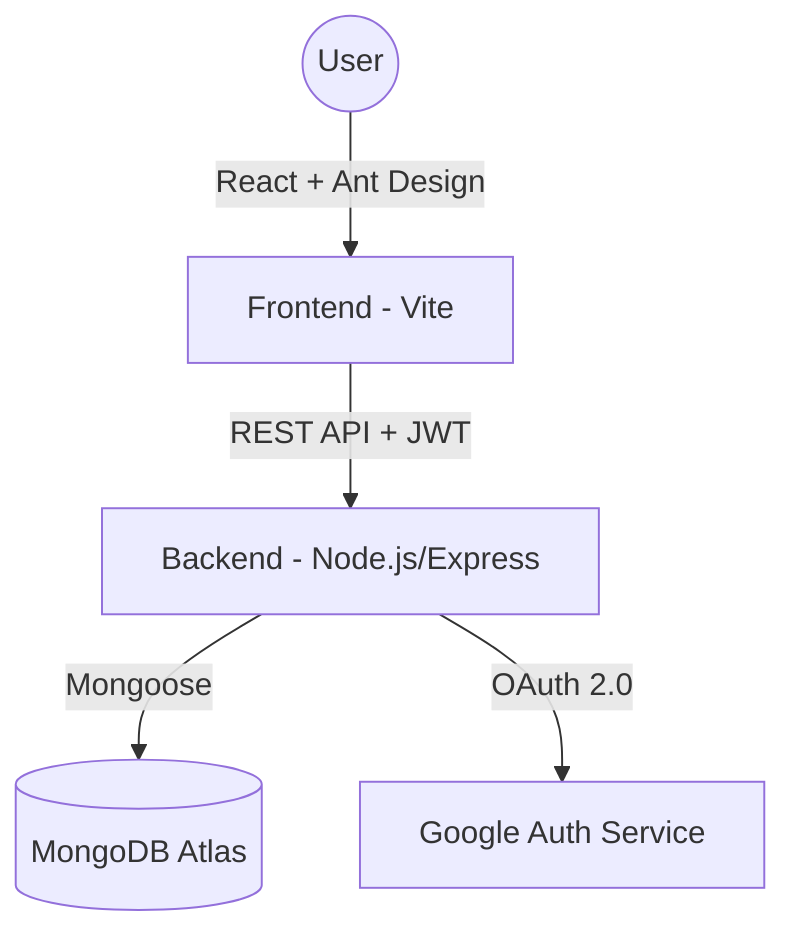

# LabBooking: Modern Lab Slot & Attendance Management System

[](https://mongodb.com/mern-stack)
[](https://opensource.org/licenses/MIT)

**LabBooking** is a high-performance MERN stack application designed to streamline laboratory scheduling and attendance tracking in academic environments. It eliminates scheduling conflicts and automates attendance through a secure, OTP-based verification system.

---

## 🏗️ System Architecture



---

## 🚀 Key Features

### 🎓 For Students
- **Smart Filtering**: Automatic lab slot filtering based on student department (CSE, ECE, EEE).
- **One-Click Booking**: Seamless reservation system with real-time capacity tracking.
- **Secure Attendance**: 4-digit OTP verification system for fraud-proof attendance marking.
- **Academic Portfolio**: Dedicated dashboard to track bookings, attendance history, and lab marks.

### 🏫 For Faculty & Admin
- **Dynamic Slot Orchestration**: Full CRUD capabilities for managing lab availability across departments.
- **Live Attendance Engine**: Generate secure, time-expiring OTPs (15-20s) for classroom sessions.
- **Performance Analytics**: Track student attendance and assign lab evaluation marks directly through the portal.
- **Centralized Dashboard**: High-level overview of daily schedules and pending actions.

### 🔐 Security & Auth
- **Hybrid Authentication**: Support for traditional Email/Password and modern Google OAuth 2.0.
- **Role-Based Access Control (RBAC)**: Strict permission boundaries for Students, Faculty, and Administrators.
- **JWT Session Management**: Secure, stateless authentication with cross-origin cookie support.

---

## 🛠️ Tech Stack

- **Frontend**: React 18, Vite, Ant Design (UI Framework), Axios, Framer Motion (Animations).
- **Backend**: Node.js, Express.js.
- **Database**: MongoDB with Mongoose ODM.
- **DevOps**: JWT, Google OAuth API, Dotenv.

---

## 📦 Installation & Setup

### Prerequisites
- Node.js (v16+)
- MongoDB (Local or Atlas)
- Google Cloud Console Project (for OAuth)

### 1. Clone & Install
```bash
git clone https://github.com/Surya2730/StudentLabBookingWebApp.git
cd StudentLabBookingWebApp

# Install Backend Deps
cd server && npm install

# Install Frontend Deps
cd ../client && npm install
```

### 2. Environment Configuration
Create a `.env` file in the `server` directory:
```env
PORT=5000
MONGO_URI=your_mongodb_uri
JWT_SECRET=your_secret_key
FRONTEND_URL=http://localhost:5173
GOOGLE_CLIENT_ID=your_google_id
```

### 3. Execution
```bash
# Start Backend (from /server)
npm start

# Start Frontend (from /client)
npm run dev
```

---

## 👨‍💻 Author
**Surya Kumar T** - [GitHub](https://github.com/Surya2730)

---
*Developed with a focus on UX/UI excellence and scalable architecture.*
